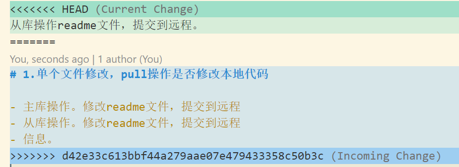
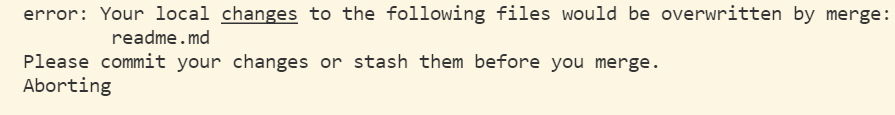

# 1.同一文件被提交到本地仓库，pull操作是否覆盖从库本地代码

- 主库操作。修改readme文件，提交到远程main分支
- 从库操作。修改readme文件，提交到远程main分支
- 信息。`failed to push some refs to `
- 需要先使用pull操作将本地代码更新，然后再将代码推到远程main分支
- pull操作后，readme文件产生冲突
- 
- 主从两次操作都显示在文件中，修改文件后，主库提交，从库pull操作同步

# 2.从库文件被修改，但未执行commit等命令，pull操作后，是否会覆盖本地文件-

- 主库push远程仓库
- 从库修改文件，不执行commit命令，直接执行pull命令
- 
- pull操作被终止，需要在merge之前先执行commit或stash命令
- 从库执行`git stash`命令，储藏文件，控制台信息`Saved working directory and index state WIP on main`
- 从库执行pull操作，拉取成功，执行`git stash pop`命令恢复储藏的文件
- 从库readme文件冲突，将冲突部分处理，从库得到最新代码，push到远程，远程仓库得到最新代码，第二次实验结束

# 3. 同分分支不同文件的修改

- 主库文件修改，push到远程仓库
- 